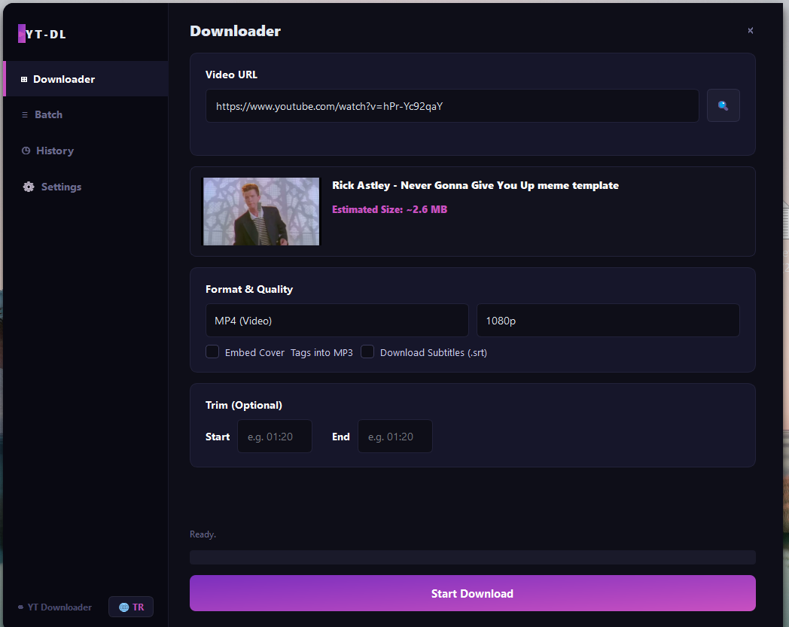
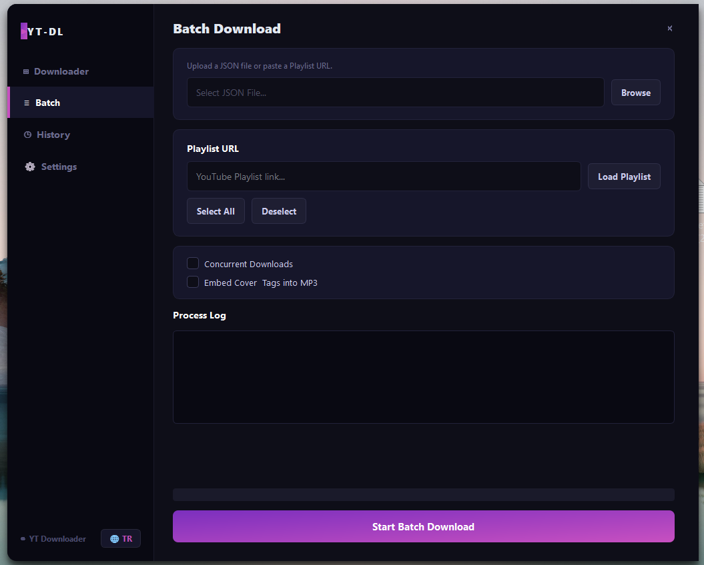

# YT-DL — YouTube Downloader

<p align="center">
  
</p>

<p align="center">
  
  
  
  
</p>

A modern, feature-rich YouTube downloader built with Python and PyQt5. Supports single video and batch/playlist downloads, MP4 and MP3 formats, trim, ID3 tagging, subtitle embedding, download history, and a system tray icon — all wrapped in a sleek dark UI.

---

## Table of Contents

- [Screenshots](#screenshots)
- [Features](#features)
- [Requirements](#requirements)
- [Installation](#installation)
- [ffmpeg Setup (Required)](#ffmpeg-setup-required)
- [Usage](#usage)
- [How It Works — Educational Overview](#how-it-works--educational-overview)
- [Project Structure](#project-structure)
- [Configuration](#configuration)
- [FAQ](#faq)

---

## Screenshots

**Main Downloader Page**


**Playlist / Batch Downloader**



---

## Features

| Feature | Description |
|---|---|
| 🎬 Single Download | Download any YouTube video as MP4 (360p – 1080p) or MP3 (128k – 320k) |
| 📋 Batch / Playlist | Load a JSON file or paste a playlist URL, select individual items and download all at once |
| ⚡ Concurrent Downloads | Download multiple videos simultaneously (configurable 1–8 threads) |
| ✂️ Trim | Clip a specific time range from a video using ffmpeg |
| 🏷️ ID3 Tagging | Embed cover art and metadata into MP3 files automatically |
| 🎞️ Subtitles | Download `.srt` subtitle files (Turkish & English) alongside the video |
| 📂 History | SQLite-backed download history with folder navigation and delete actions |
| ⚙️ Settings | Persist default format, quality, save path, language, and concurrency |
| 🌐 Bilingual | Full Turkish / English UI with one-click language toggle |
| 🔔 System Tray | Minimizes to tray, shows download-complete notifications |
| 🔄 Auto Update Check | Checks for newer yt-dlp releases on startup and offers to upgrade |

---

## Requirements

- **Python 3.8+**
- **ffmpeg** (see [ffmpeg Setup](#ffmpeg-setup-required) below — this is mandatory)

Python packages:

```
PyQt5
yt-dlp
```

Install them with:

```bash
pip install PyQt5 yt-dlp
```

---

## Installation

```bash
# 1. Clone the repository
git clone https://github.com/seesternn/yt-dl.git
cd yt-dl

# 2. Install dependencies
pip install PyQt5 yt-dlp

# 3. Place ffmpeg.exe next to the script (see section below)

# 4. Run
python yt_downloader.py
```

---

## ffmpeg Setup (Required)

**ffmpeg is required** for merging audio/video streams, converting to MP3, embedding thumbnails, trimming, and subtitle handling. Without it the downloader will show an error and refuse to start downloads.

### Step-by-step (Windows)

1. Go to **[https://www.gyan.dev/ffmpeg/builds/](https://www.gyan.dev/ffmpeg/builds/)**
2. Under *Release builds*, download **`ffmpeg-release-essentials.zip`**
3. Extract the zip file
4. Open the extracted folder → go into the `bin/` subfolder
5. Copy **`ffmpeg.exe`** into the same folder as `yt_downloader.py` (or your compiled `.exe`)

Your folder should look like this:

```
yt-dl/
├── yt_downloader.py
├── ffmpeg.exe          ← place it here
├── settings.json       (auto-created on first run)
└── history.db          (auto-created on first run)
```

### Where the app looks for ffmpeg

The app searches these locations in order and uses the first one it finds:

1. Inside the PyInstaller `_MEIPASS` bundle (if running as a compiled `.exe`)
2. `ffmpeg/ffmpeg.exe` sub-folder next to the script
3. `ffmpeg/bin/ffmpeg.exe` sub-folder (official zip layout)
4. Directly next to the script/exe
5. System `PATH` (via `shutil.which`)

If ffmpeg is not found, a red `✘ ffmpeg yok!` indicator appears in the sidebar and downloads are blocked with a clear error message.

### macOS / Linux

On macOS or Linux, install ffmpeg via your package manager:

```bash
# macOS
brew install ffmpeg

# Ubuntu / Debian
sudo apt install ffmpeg

# Arch Linux
sudo pacman -S ffmpeg
```

The app will find it automatically via system `PATH`.

---

## Usage

### Single Video Download

1. Paste a YouTube URL into the URL field (or drag & drop a link onto the window)
2. Click 🔍 to fetch video info — a thumbnail preview and estimated file size will appear
3. Select format (`MP4` or `MP3`) and quality
4. Optionally enable ID3 tagging, subtitle download, or set a trim range
5. Click **Start Download**

### Batch / Playlist Download


**Via Playlist URL:**
1. Switch to the *Batch* tab
2. Paste a YouTube playlist URL and click **Load Playlist**
3. Check or uncheck individual videos from the table
4. Enable *Concurrent Downloads* to speed things up
5. Click **Start Batch Download**

**Via JSON file:**

Create a `.json` file in this format and load it with the *Browse* button:

```json
[
  {
    "url": "https://www.youtube.com/watch?v=XXXXXXXXXXX",
    "format": "MP4",
    "quality": "720p",
    "title": "My Video"
  },
  {
    "url": "https://www.youtube.com/watch?v=YYYYYYYYYYY",
    "format": "MP3",
    "quality": "192k",
    "title": "My Audio"
  }
]
```

### Trim

Enter start and end timestamps (`MM:SS` or `HH:MM:SS`) in the *Trim* section. ffmpeg will cut the output to that range.

---

## How It Works — Educational Overview

This section explains the key design patterns and Python concepts used in the project.

### Architecture

The app follows a **worker thread + signal/slot** pattern. The GUI runs on the Qt main thread; all network and download operations run in background `QThread` workers that communicate with the UI via `pyqtSignal`.

```
MainApp (QWidget — main thread)
│
├── InfoWorker (QThread)        — fetches video metadata & thumbnail
├── PlaylistWorker (QThread)    — fetches playlist entries (flat extract)
├── DownloadWorker (QThread)    — runs yt-dlp downloads
│       └── ThreadPoolExecutor  — concurrent sub-downloads
└── UpdateWorker (QThread)      — checks GitHub API for yt-dlp updates
```

### Key Concepts

**QThread & pyqtSignal**

PyQt5 forbids touching UI widgets from background threads. The solution is to define signals on the worker, emit them from the thread, and connect them to UI slots on the main thread. Qt's signal/slot mechanism handles thread-safe marshalling automatically.

```python
class DownloadWorker(QThread):
    progress = pyqtSignal(int, str, str)   # percent, speed, eta
    finished = pyqtSignal(str, str, float) # title, url, size_mb
    error    = pyqtSignal(str)

    def run(self):
        # This runs in a background thread
        self.progress.emit(50, "1.2 MiB/s", "0:30")
```

**yt-dlp integration**

yt-dlp is used as a Python library (not a CLI call). The `YoutubeDL` context manager accepts an `opts` dict that controls every aspect of the download — format selection, post-processors, ffmpeg location, progress hooks, and more.

```python
opts = {
    'format': 'bestvideo[ext=mp4][height<=720]+bestaudio[ext=m4a]/best',
    'merge_output_format': 'mp4',
    'ffmpeg_location': '/path/to/ffmpeg',
    'progress_hooks': [self.progress_hook],
    'postprocessors': [{'key': 'FFmpegExtractAudio', 'preferredcodec': 'mp3'}],
}
with yt_dlp.YoutubeDL(opts) as ydl:
    info = ydl.extract_info(url, download=True)
```

**Concurrent downloads with ThreadPoolExecutor**

When the user enables concurrent downloads, a `ThreadPoolExecutor` runs multiple `_download_one()` calls in parallel. A `threading.Lock` protects the shared counter used for log labelling.

```python
with ThreadPoolExecutor(max_workers=self.concurrent) as ex:
    futures = [ex.submit(job, task) for task in self.tasks]
    for f in as_completed(futures):
        f.result()   # re-raises any exception from the thread
```

**SQLite history**

Download history is stored in a local `history.db` SQLite database using Python's built-in `sqlite3` module. Each completed download writes a row with title, URL, file size, format, quality, save path, and timestamp.

**PyInstaller compatibility**

The app is designed to run both as a plain Python script and as a compiled PyInstaller executable. `sys.frozen` and `sys._MEIPASS` are checked to locate resources and ffmpeg correctly in both environments.

**Settings persistence**

User preferences are saved as a JSON file (`settings.json`) next to the executable. `load_config()` merges saved values over the defaults, so new keys added in updates don't break existing configs.

**Frameless window + drag**

The window uses `Qt.FramelessWindowHint` for a custom title bar look. Window dragging is implemented by tracking `mousePressEvent` and `mouseMoveEvent` on the main widget.

### Format Selection Logic

For MP4 downloads, yt-dlp uses a format string that prefers separate video and audio streams and merges them with ffmpeg:

```
bestvideo[ext=mp4][height<=720]+bestaudio[ext=m4a]/best[ext=mp4][height<=720]/best
```

For MP3, yt-dlp downloads the best audio stream and runs it through the `FFmpegExtractAudio` post-processor.

---

## Project Structure

```
yt-dl/
├── yt_downloader.py    — entire application (single-file)
├── ffmpeg.exe          — required binary (not included, download separately)
├── settings.json       — auto-generated user config
├── history.db          — auto-generated SQLite database
├── mainpage.png        — screenshot used in README
└── playlist.png        — screenshot used in README
```

---

## Configuration

`settings.json` is created automatically on first run. You can edit it manually:

```json
{
    "language": "TR",
    "default_format": "MP4",
    "default_mp4_quality": "720p",
    "default_mp3_quality": "192k",
    "save_path": "C:/Users/YourName/Downloads",
    "concurrent_downloads": 2
}
```

| Key | Values | Description |
|---|---|---|
| `language` | `"TR"` / `"EN"` | UI language |
| `default_format` | `"MP4"` / `"MP3"` | Pre-selected format |
| `default_mp4_quality` | `"360p"` `"480p"` `"720p"` `"1080p"` | Default video resolution |
| `default_mp3_quality` | `"128k"` `"192k"` `"256k"` `"320k"` | Default audio bitrate |
| `save_path` | any valid directory path | Where files are saved |
| `concurrent_downloads` | `1` – `8` | Max parallel downloads |

---

## FAQ

**The download starts but no file appears.**
Make sure `save_path` in settings points to a folder you have write access to. Check the Process Log in the Batch tab for errors.

**I get a "Merge required" error or the video has no audio.**
ffmpeg is not found. Follow the [ffmpeg Setup](#ffmpeg-setup-required) section carefully.

**Estimated size shows "Unknown".**
This is normal for some videos where yt-dlp cannot determine file size before downloading (e.g. live streams or certain formats).

**The app disappears from the taskbar.**
It minimizes to the system tray. Double-click the tray icon to bring it back, or right-click → *Show*.

**How do I update yt-dlp?**
The app checks automatically on startup. If an update is available it will prompt you. You can also run `pip install --upgrade yt-dlp` manually.

---

## License

MIT — see [LICENSE](LICENSE) for details.

---

<p align="center">Made with ♥ by <a href="https://github.com/seesternn">seesternn</a></p>
